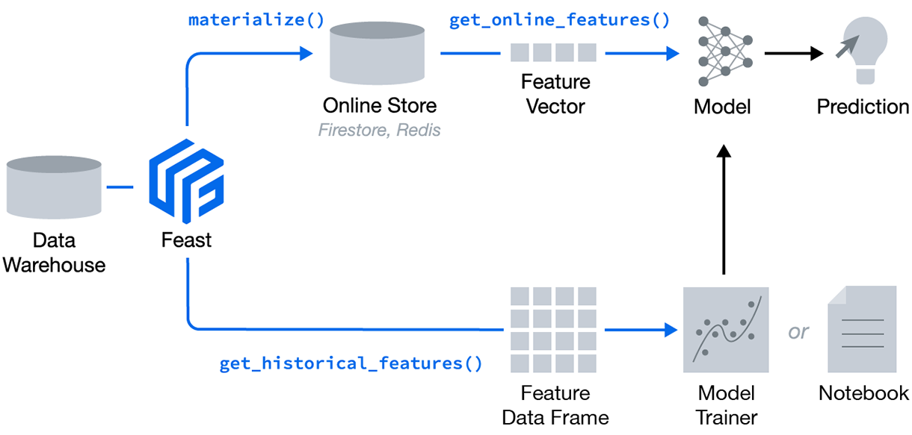

### What is Feast?

[Feast](https://feast.dev/) is an operational data system for managing and serving machine learning features to
models in production. It can serve features from a low-latency offline store (for real-time prediction)
or from an off-line store (for scale-out batch scoring or training models).


Feature stores have emerged as a pivotal component in the modern machine learning stack, as more data scientists
and engineers work together to operationalize ML. Associated with this task are some operational challenges.
The toughest challenges for operationalizing ML is data: how to compute and select features, store,
validate serve, discover and share them.

### Goal and Objective
In this series of self-paced hands-on workshops, divided them into 4 modules, you will learn:

* What key problems feature stores solve to operationalize ML
* Why features stores are a pivotal components in the model machine learning stack
* Common key use cases and deployment patterns for feature stores observed by the MLOps and ML practitioners
* How feature stores are playing a transformational role with the rise of modern data platforms
* Get a hands-on experience with the popular open source feature store Feast

This repo is an adaptation made by ```Enrique Corro (ecorro@vmware.com)``` (targeting internal VMware audiences) from
the original workshop's GitHub repo https://github.com/dmatrix/feast_workshops is authored by Jules S. Damji.

The changes on the original repo are as follows:
- Update the Python code to comply with the Feast SDK v0.21.3. The original workshop was based on a much older Feast
  version that was using deprecated parameters and classes.
- Concentrated all the Python code in a single notebook per module. This is much more convenient for didactic purposes.
- Fixed the ML modeling parts that were incorrect.
- Added ```module 4``` to include a demonstration on how to combine Feast with the Great Expectations' library to conduct
  data validation tasks.

### Instructions
Please proceed to ```Module 1``` and follow the instruction provided in the ```README.md``` file of that directory. 
After completing ```Module 1``` you need to proceed to ```Module2```. ```Modules 3 and 4``` are independent from the 
previous two but more advanced. You may do these last two in any order.