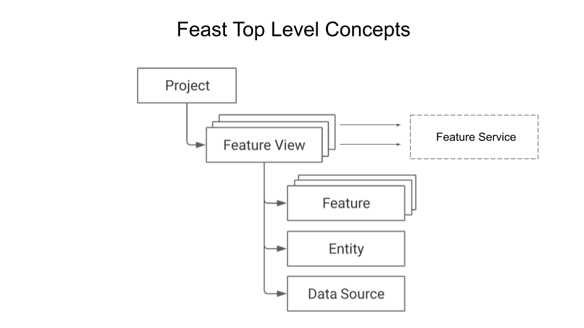

### Module 1
This module will focus on understanding key concepts and Feast objects. In this module we will:
 * Deploy a local feature store with a Parquet file offline store and Sqlite online store.
 * Build a training dataset using our time series features from our Parquet files.
 * Materialize feature values from the offline store into the online store.
 * Read the latest features from the online store for inference.

In particular, we'll cover the following:
 * Introduction to Feature Stores
   * Key concepts in Feast
     * Projects
     * Feast Repos
     * Data Source
     * Entity
     * Features and Features Views
     * Feature Service
     * Offline & Online Stores
   * Learn Feast APIs
     * Declare and define Feast Object using Feast Declarative APIs
     * Use an IDE, Google Colab or Jupyter Notebook demonstrating how to use Feast APIs




### Feast Talks Worth Watching

[Watch Video 1](https://www.youtube.com/watch?v=6OCUMbEtSLU)

[Watch Video 2](https://youtu.be/vMreZGyYrh8)


### Steps
#### Step 1: 
``` conda create --name feast_workshop ```
#### Step 2:
``` conda activate feast_workshop ```
#### Step 3: 
``` 
pip install -r requirements.txt
pip install ipykernel 
python -m ipykernel install --user --name feast_workshop
```
#### Step 4:
> Go to the feature_repo/notebook directory to run the driver.ipynb Jupyter notebook that will walk you through the 
initial concepts about Feast.