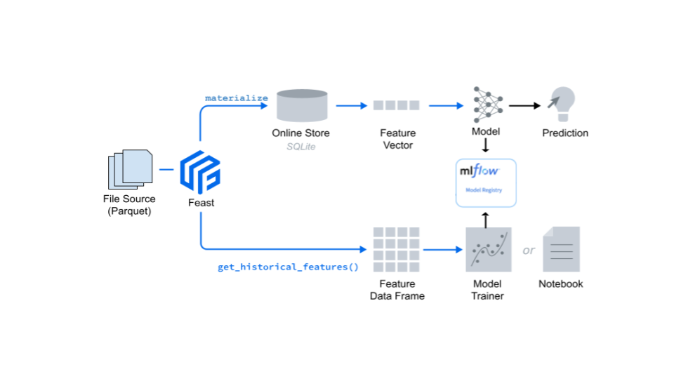

### Module 2
Built upon what you learned in Module 1, we will primarily see how the key Feast concepts and Feast are put to use.
In particular, we'll focus on:

 * Introduce [MLflow](https://mlflow.org/docs/latest/concepts.html) concepts and how you can use it for machine learning models
 * Fetch training data from our offline store, a local feature store offline store as a Parquet file 
 * Train a multilayer perceptron model
   * Use few tuning parameters and create three MLflow runs
 * Use [MLflow](https://mlflow.org/) to track our [experimental runs](https://mlflow.org/docs/latest/tracking.html) and register the model with the [MLflow Model Registry](https://mlflow.org/docs/latest/model-registry.html)
 * Navigate the MLflow UI, examine training runs, and register a model
 * Fetch feature vector for a list of drivers and predict which is the best ranked driver 



### Videos Worth Watching

[MLflow Workshops](https://www.youtube.com/playlist?list=PLTPXxbhUt-YWjDg318nmSxRqTgZFWQ2ZC)

### Steps
#### Step 1:
Activate the conda environment used in Module 1. This should have all the packages
installed in module 1.

``` conda activate feast_workshop ```
#### Step 2:
Launch the Mlflow UI for experiment management

```mlflow ui --backend-store-uri sqlite:///mlruns.db```

> Connect to local host at `http://127.0.0.1:5000`

#### Step 3: 
Train the model, pick the best, make predictions and promote the model to production. 
> Open the ```train_and_predict.ipynb``` notebook and run the cells to walk through the model development and deployment process.