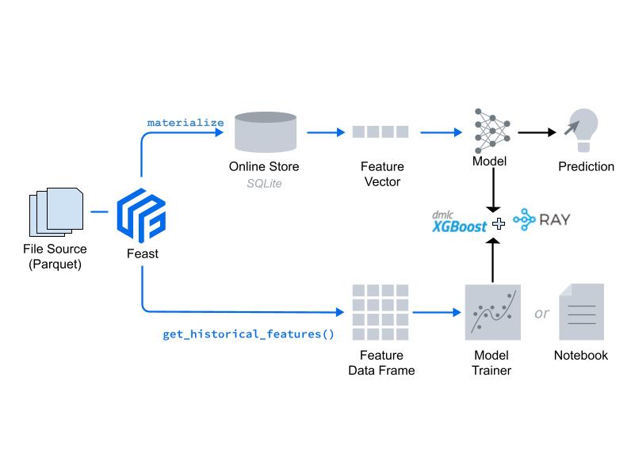

### A Credit Scoring Use Case for Loan Approval

#### Workshop Tasks:
 * Declare and Define all Feast Primitives or First Class Objects (fco)
 * Create a Feature Store using Feast APIs
 * Train model using XGBoost fetching training data from Feast offline store
 * Get data from Feast online store for credit score and loan approval and make predictions.
 * NOTE: Ray is not used in this lab (ignore from the image, the rest of the components are good). For a dataset this size it'd be an overkill.



### Steps

### Step 1:
Activate the conda environment used in Module 1. This should have all the packages
installed in module 1.

``` conda activate feast_workshop ```
### Step 2:
> Go to the ```labs``` directory, open the ```DEMO_credit_scoring_feature_enrichment.ipynb``` from jupyter lab and
> execute the cells to go over the model development process.